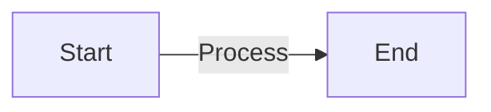
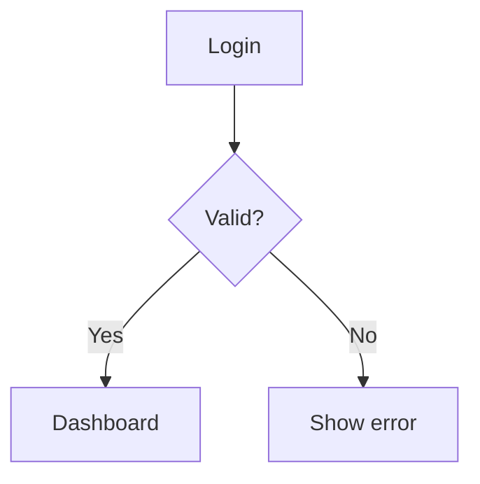
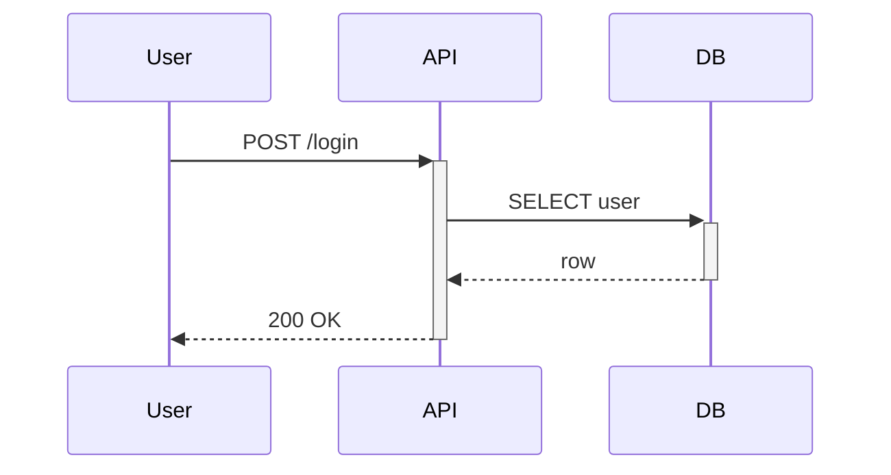
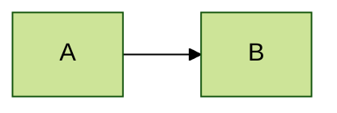

# Mermaid

Renders Mermaid diagrams at build time. Supports the full Mermaid v10+
catalogue.

## Basic flowchart

````markdown

````

## Decision tree

````markdown

````

## Sequence diagram

````markdown

````

## Other supported types

- `classDiagram` — class structure.
- `erDiagram` — entity relationships.
- `stateDiagram-v2` — state machines.
- `gantt` — project schedules.
- `journey` — user journeys.
- `mindmap` — radial idea maps.
- `sankey-beta` — flow diagrams.
- `xychart-beta` — quick bar / line charts.
- `architecture-beta` — cloud architecture.

## Theme override

Set per-diagram theme with the init directive:

````markdown

````

## Tips

- Keep node labels short.
- Use `graph LR` (left-to-right) for processes; `graph TD` (top-down) for
  hierarchies and decisions.
- For freeform relationship graphs without a fixed layout, use
  [`force-graph`](../force-graph/SKILL.md).
- For step-by-step processes, prefer [`workflow`](../workflow/SKILL.md) — it
  has a richer "lane" layout.
