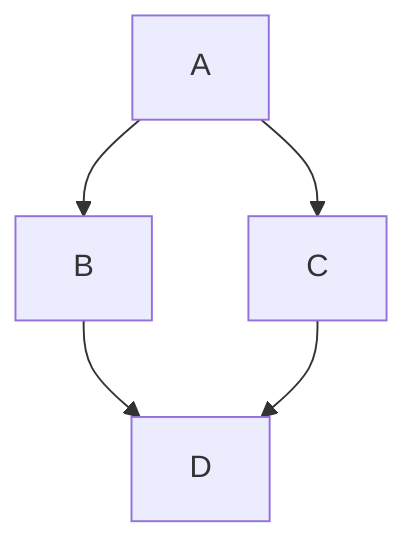
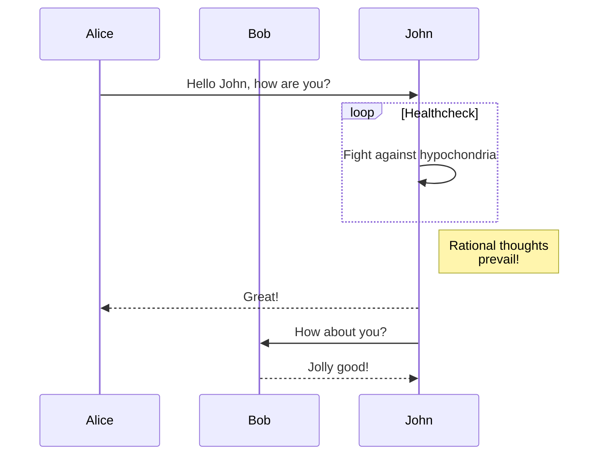

# Mathematical Formulas and Diagrams

For technical documentation in fields like data science, physics, or engineering, plain text isn't enough. Neko provides native support for **KaTeX** math and **Mermaid** diagrams.

## Math with KaTeX

KaTeX is a fast and lightweight math typesetting library.

### Inline Math

Use the `$` delimiter for inline math: $E=mc^2$

### Block Math

Use the `$$` delimiter for block math:

$$
\sum_{i=1}^n i^2 = \frac{n(n+1)(2n+1)}{6}
$$

## Diagrams with Mermaid

Mermaid lets you create diagrams and visualizations using text and code.

### Flowchart

### Sequence Diagram

### Supported Diagram Types

- Flowchart
- Sequence Diagram
- Class Diagram
- State Diagram
- Entity Relationship Diagram
- Gantt Chart
- Pie Chart

Visualize your logic clearly with Neko's diagram support.
