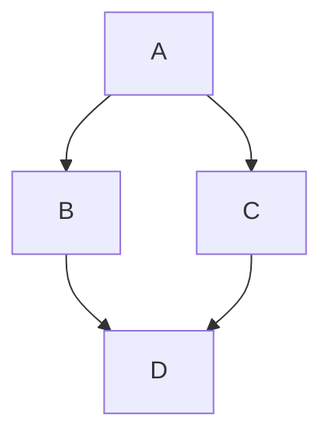
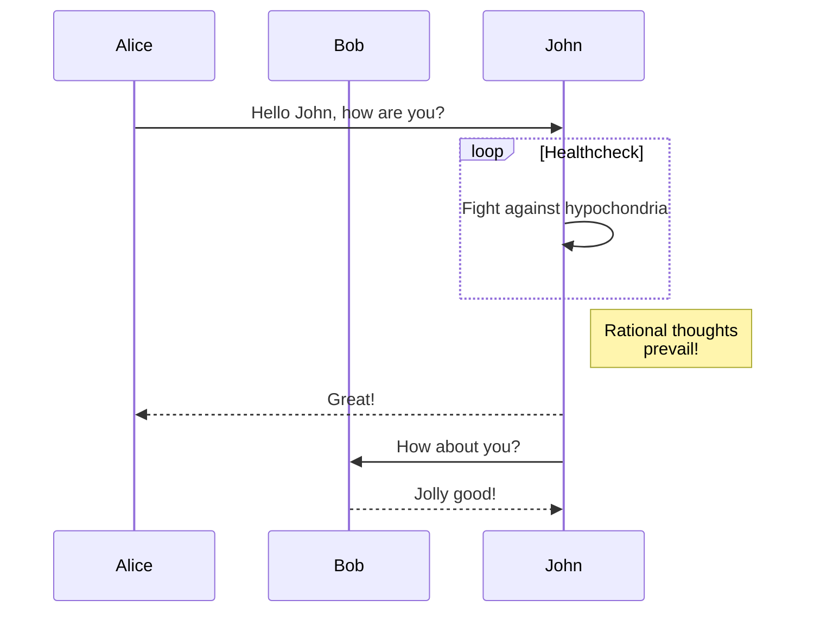
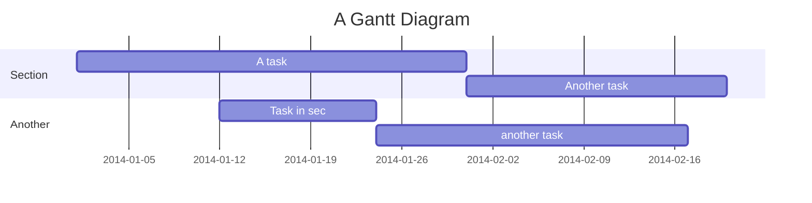
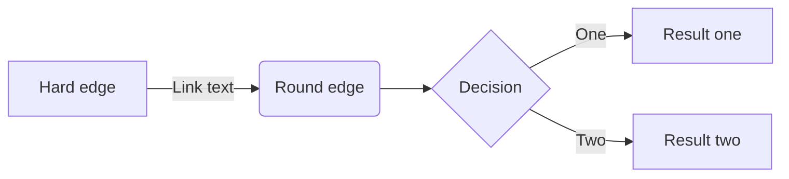

# Mermaid

Create diagrams and visualizations using text and code with **Mermaid**. TailDocs renders Mermaid diagrams natively in the browser.

## Syntax

Use fenced code blocks with the `mermaid` language identifier.

### Graph Diagram



Code:
```markdown

```

### Sequence Diagram



### Gantt Chart



### Flowchart



## Tips

- Diagrams are rendered client-side, so they work even if you host the site statically.
- Ensure valid Mermaid syntax, or the diagram might fail to render.
